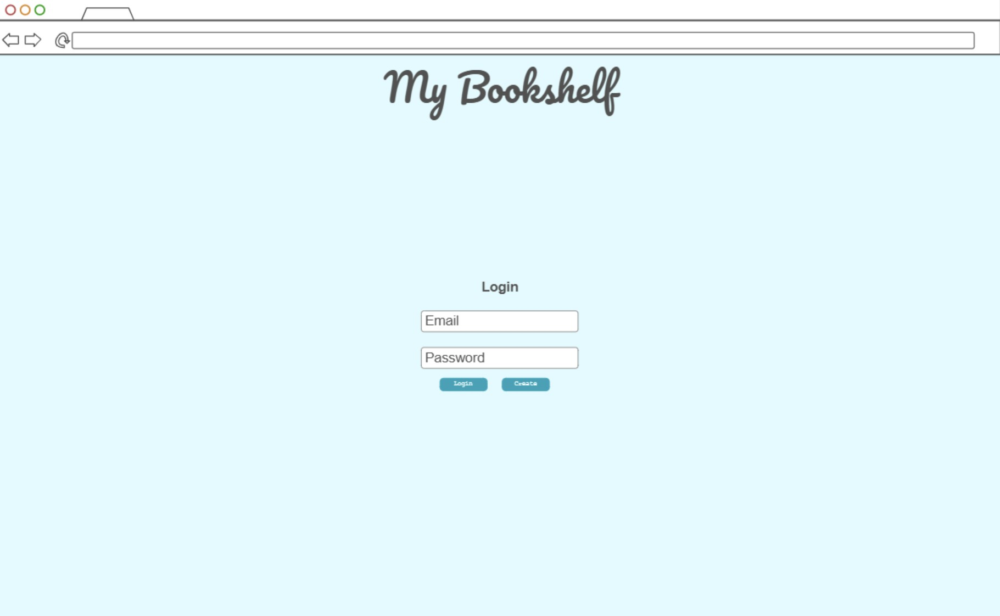
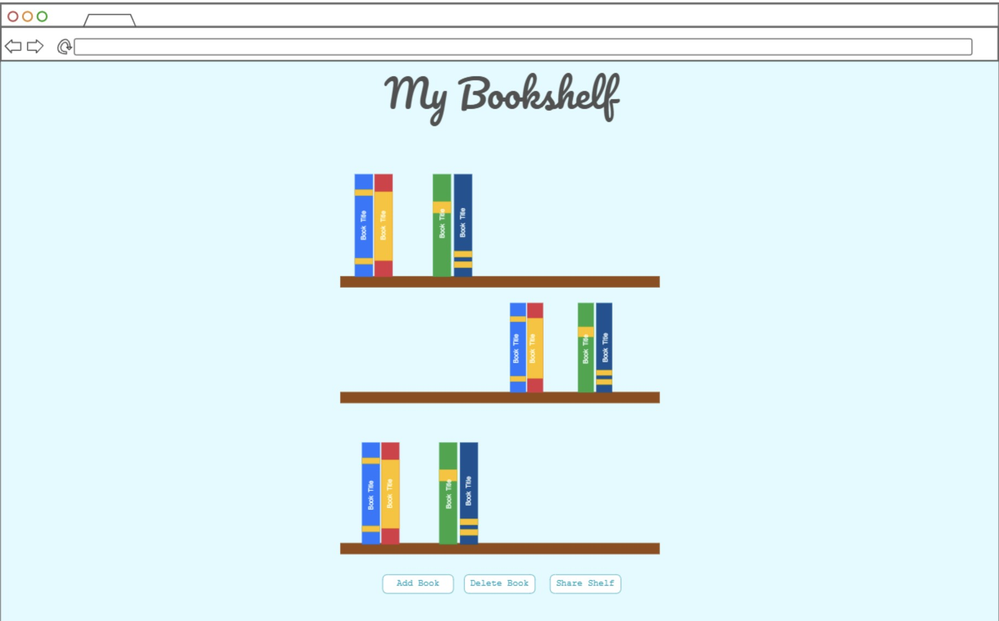
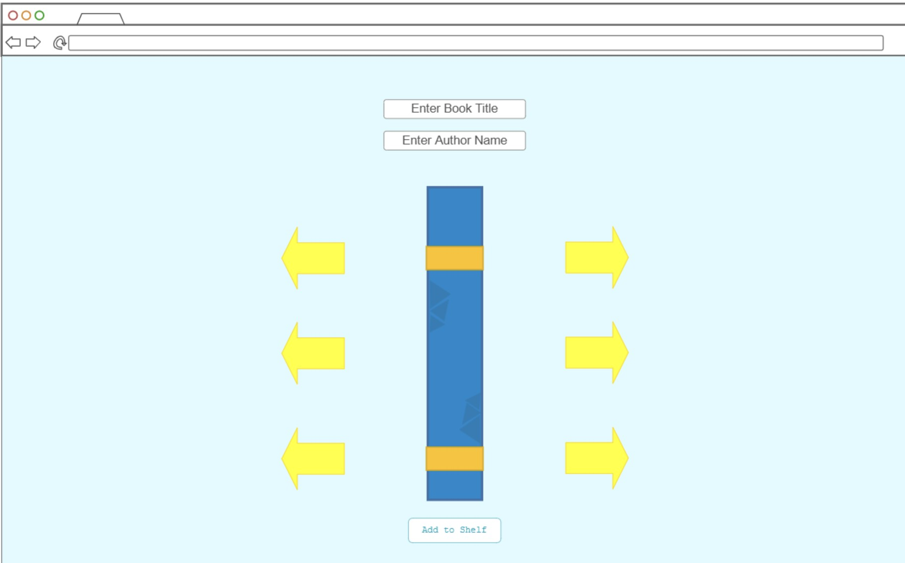
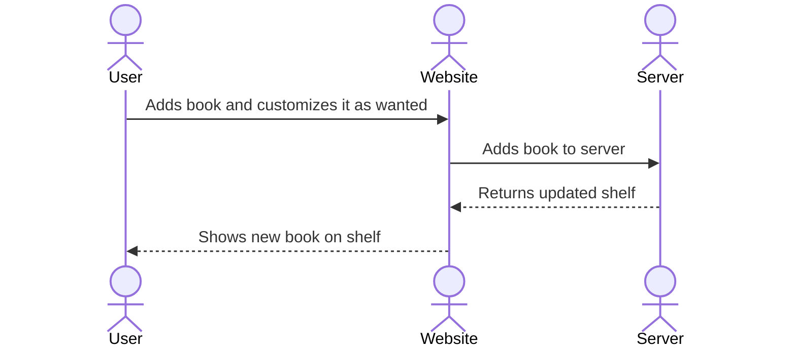

# My Bookshelf

[My Notes](notes.md)

This website allows you to create and customize book covers to represent books you've read, want to read or for any number of reasons. It gives you a creative way to show your taste in books and literature. It also has the ability for you to share your bookshelf with others via URL so others can see it as well.

> [!NOTE]
>  This is a template for your startup application. You must modify this `README.md` file for each phase of your development. You only need to fill in the section for each deliverable when that deliverable is submitted in Canvas. Without completing the section for a deliverable, the TA will not know what to look for when grading your submission. Feel free to add additional information to each deliverable description, but make sure you at least have the list of rubric items and a description of what you did for each item.

> [!NOTE]
>  If you are not familiar with Markdown then you should review the [documentation](https://docs.github.com/en/get-started/writing-on-github/getting-started-with-writing-and-formatting-on-github/basic-writing-and-formatting-syntax) before continuing.

## 🚀 Specification Deliverable

> [!NOTE]
>  Fill in this sections as the submission artifact for this deliverable. You can refer to this [example](https://github.com/webprogramming260/startup-example/blob/main/README.md) for inspiration.

For this deliverable I did the following. I checked the box `[x]` and added a description for things I completed.

- [x] Proper use of Markdown
- [x] A concise and compelling elevator pitch
- [x] Description of key features
- [x] Description of how you will use each technology
- [x] One or more rough sketches of your application. Images must be embedded in this file using Markdown image references.

### Elevator pitch

It can be exciting to put together a book collection and show off the books you enjoy. However, it is not always easy to share your collection in a way that is personal and shareable. My website allows you to design custom book covers and arrange them on a virtual shelf. You can show off what you’ve read, what you want to read, or a mix of both in a unique and personal display. This fun and interactive platform gives readers a creative way to showcase their taste and share it with their friends.

### Design

This shows how the user interacts with the website and server to add a book to their shelf.

### Key features

- Secure login over HTTPS
- Displays bookshelf of created books.
- Allows the customization of color and design of book spine.
- Ability for user to pick what shelf to add it to.
- Allows the user to share their bookshelf with others.

### Technologies

I am going to use the required technologies in the following ways.

- **HTML** - Uses correct HTML structure for application. Three HTML pages. One for login, one to display bookshelf and one to customize your book.
- **CSS** - Application styling to look good on different screen sizes, uses good whitespace and neutral colors so the book covers stand out.
- **React** - Provides login, bookshelf display, interactive book customization, sharing bookshelf with others.
- **Service** - Backend service with endpoints for:
    - Adding books
    - Removing books
    - Creating a shareable link
    - Register, login, and logout users.
- **DB/Login** - Store users, bookshelf and books in database. Register and login users. Credentials stored in secure database. Can't create bookshelf without authentication.
- **WebSocket** - As books are added, the bookshelf updates in real time so those you are sharing with can see it.

## 🚀 AWS deliverable

For this deliverable I did the following. I checked the box `[x]` and added a description for things I completed.

- [x] **Server deployed and accessible with custom domain name** - [My server link](https://mybookshelf260.click).

## 🚀 HTML deliverable

For this deliverable I did the following. I checked the box `[x]` and added a description for things I completed.

- [x] **HTML pages** - I have four html pages: index.html, bookshelf.html, friends.html, customize.html
- [x] **Proper HTML element usage** - I spent a lot of time learning about the different elements, especially about buttons and svgs so that they would show up the way I want to.
- [x] **Links** - Everything links to the page that it is supposed to, using the navigation bar and the books as buttons.
- [x] **Text** - Every page has sufficient text.
- [x] **3rd party API placeholder** - The bookshelf page has a place to generator a unique url that is shorter and easy to copy/paste for friends.
- [x] **Images** - There are svg images on the bookshelf and customize page to show what they might look like.
- [x] **Login placeholder** - There is a login page.
- [x] **DB data placeholder** - There is a place for books to be stored and changed.
- [x] **WebSocket placeholder** - There is a friends page where you can visit other friends bookshelves.

## 🚀 CSS deliverable

For this deliverable I did the following. I checked the box `[x]` and added a description for things I completed.

- [x] **Header, footer, and main content body** - I used a main.css file to style with additional css files for each page for extra customization.
- [x] **Navigation elements** - I stylized the navigation elements so they are centered with the title at the top of the page.
- [x] **Responsive to window resizing** - The windows respond to resizing.
- [x] **Application elements** - The elements are styled with unique colors that go together and fit the aesthetic of the website.
- [x] **Application text content** - I pulled in different fonts from Google Fonts to stylize and fit the aesthetic.
- [x] **Application images**  - I stylized the images with some new text and button functionality as well as making sure they are centered where they need to be.

## 🚀 React part 1: Routing deliverable

For this deliverable I did the following. I checked the box `[x]` and added a description for things I completed.

- [x] **Bundled using Vite** - I installed vite and followed the instructions given for simon for my startup.
- [x] **Components** - I added all of the components that correspond with my different web pages as instructed in the simon example.
- [x] **Router** - I followed the instructions to create a router to display my website properly.

## 🚀 React part 2: Reactivity deliverable

For this deliverable I did the following. I checked the box `[x]` and added a description for things I completed.

- [x] **All functionality implemented or mocked out** - Everything is working. Books are currently stored in localStorage.
- [x] **Hooks** - used useEffect and useState on my bookshelf page and customize page.

## 🚀 Service deliverable

For this deliverable I did the following. I checked the box `[x]` and added a description for things I completed.

- [x] **Node.js/Express HTTP service** - Uses node.js and express to connect the frontend to the backend
- [x] **Static middleware for frontend** - There's static middleware to connect the frontend to the backend
- [x] **Calls to third party endpoints** - Calls a third party api to display a new picture banner above the Bookshelf every time you return to the page.
- [x] **Backend service endpoints** - Endpoints for login, logout, create and getting and saving the bookshelf.
- [x] **Frontend calls service endpoints** - Frontend calls the backend service points to actually have a sort of persistence between user bookshelves.
- [x] **Supports registration, login, logout, and restricted endpoint** - Has end points for all authorization methods.

## 🚀 DB deliverable

For this deliverable I did the following. I checked the box `[x]` and added a description for things I completed.

- [x] **Stores data in MongoDB** - Books are properly stored in bookshelves separated by users and persist in the database.
- [x] **Stores credentials in MongoDB** - Users and authTokens are stored in the database.

## 🚀 WebSocket deliverable

For this deliverable I did the following. I checked the box `[x]` and added a description for things I completed.

- [x] **Backend listens for WebSocket connection** - Backend receives the websocket connection.
- [x] **Frontend makes WebSocket connection** - Frontend receives messages from the backend.
- [x] **Data sent over WebSocket connection** - Bookshelf is updated when the owner updates it.
- [x] **WebSocket data displayed** - You can see the updated bookshelf immediately.
- [x] **Application is fully functional** - It works for the most part. It only works if the person who is editing the bookshelf is the last person who logged in.
