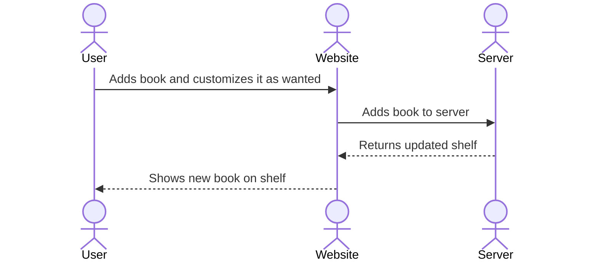

# My Bookshelf

[My Notes](notes.md)

This website allows you to create and customize book covers to represent books you've read, want to read or for any number of reasons. It gives you a creative way to show your taste in books and literature. It also has the ability for you to share your bookshelf with others via URL so others can see it as well.

> [!NOTE]
>  This is a template for your startup application. You must modify this `README.md` file for each phase of your development. You only need to fill in the section for each deliverable when that deliverable is submitted in Canvas. Without completing the section for a deliverable, the TA will not know what to look for when grading your submission. Feel free to add additional information to each deliverable description, but make sure you at least have the list of rubric items and a description of what you did for each item.

> [!NOTE]
>  If you are not familiar with Markdown then you should review the [documentation](https://docs.github.com/en/get-started/writing-on-github/getting-started-with-writing-and-formatting-on-github/basic-writing-and-formatting-syntax) before continuing.

## 🚀 Specification Deliverable

> [!NOTE]
>  Fill in this sections as the submission artifact for this deliverable. You can refer to this [example](https://github.com/webprogramming260/startup-example/blob/main/README.md) for inspiration.

For this deliverable I did the following. I checked the box `[x]` and added a description for things I completed.

- [x] Proper use of Markdown
- [x] A concise and compelling elevator pitch
- [x] Description of key features
- [x] Description of how you will use each technology
- [x] One or more rough sketches of your application. Images must be embedded in this file using Markdown image references.

### Elevator pitch

It can be exciting to put together a book collection and show off the books you enjoy. However, it is not always easy to share your collection in a way that is personal and shareable. My website allows you to design custom book covers and arrange them on a virtual shelf. You can show off what you’ve read, what you want to read, or a mix of both in a unique and personal display. This fun and interactive platform gives readers a creative way to showcase their taste and share it with their friends.

### Design

This shows how the user interacts with the website and server to add a book to their shelf.

### Key features

- Secure login over HTTPS
- Displays bookshelf of created books.
- Allows the customization of color and design of book spine.
- Ability for user to pick what shelf to add it to.
- Allows the user to share their bookshelf with others.

### Technologies

I am going to use the required technologies in the following ways.

- **HTML** - Uses correct HTML structure for application. Three HTML pages. One for login, one to display bookshelf and one to customize your book.
- **CSS** - Application styling to look good on different screen sizes, uses good whitespace and neutral colors so the book covers stand out.
- **React** - Provides login, bookshelf display, interactive book customization, sharing bookshelf with others.
- **Service** - Backend service with endpoints for:
    - Adding books
    - Removing books
    - Creating a shareable link
    - Register, login, and logout users.
- **DB/Login** - Store users, bookshelf and books in database. Register and login users. Credentials stored in secure database. Can't create bookshelf without authentication.
- **WebSocket** - As books are added, the bookshelf updates in real time so those you are sharing with can see it.

## 🚀 AWS deliverable

For this deliverable I did the following. I checked the box `[x]` and added a description for things I completed.

- [x] **Server deployed and accessible with custom domain name** - [My server link](https://mybookshelf260.click).

## 🚀 HTML deliverable

For this deliverable I did the following. I checked the box `[x]` and added a description for things I completed.

- [x] **HTML pages**
- [x] **Proper HTML element usage**
- [x] **Links**
- [x] **Text**
- [x] **3rd party API placeholder**
- [x] **Images**
- [x] **Login placeholder**
- [x] **DB data placeholder**
- [x] **WebSocket placeholder** 

## 🚀 CSS deliverable

For this deliverable I did the following. I checked the box `[x]` and added a description for things I completed.

- [x] **Header, footer, and main content body**
- [x] **Navigation elements**
- [x] **Responsive to window resizing**
- [x] **Application elements**
- [x] **Application text content**
- [x] **Application images** 

## 🚀 React part 1: Routing deliverable

For this deliverable I did the following. I checked the box `[x]` and added a description for things I completed.

- [ ] **Bundled using Vite** - I did not complete this part of the deliverable.
- [ ] **Components** - I did not complete this part of the deliverable.
- [ ] **Router** - I did not complete this part of the deliverable.

## 🚀 React part 2: Reactivity deliverable

For this deliverable I did the following. I checked the box `[x]` and added a description for things I completed.

- [ ] **All functionality implemented or mocked out** - I did not complete this part of the deliverable.
- [ ] **Hooks** - I did not complete this part of the deliverable.

## 🚀 Service deliverable

For this deliverable I did the following. I checked the box `[x]` and added a description for things I completed.

- [ ] **Node.js/Express HTTP service** - I did not complete this part of the deliverable.
- [ ] **Static middleware for frontend** - I did not complete this part of the deliverable.
- [ ] **Calls to third party endpoints** - I did not complete this part of the deliverable.
- [ ] **Backend service endpoints** - I did not complete this part of the deliverable.
- [ ] **Frontend calls service endpoints** - I did not complete this part of the deliverable.
- [ ] **Supports registration, login, logout, and restricted endpoint** - I did not complete this part of the deliverable.

## 🚀 DB deliverable

For this deliverable I did the following. I checked the box `[x]` and added a description for things I completed.

- [ ] **Stores data in MongoDB** - I did not complete this part of the deliverable.
- [ ] **Stores credentials in MongoDB** - I did not complete this part of the deliverable.

## 🚀 WebSocket deliverable

For this deliverable I did the following. I checked the box `[x]` and added a description for things I completed.

- [ ] **Backend listens for WebSocket connection** - I did not complete this part of the deliverable.
- [ ] **Frontend makes WebSocket connection** - I did not complete this part of the deliverable.
- [ ] **Data sent over WebSocket connection** - I did not complete this part of the deliverable.
- [ ] **WebSocket data displayed** - I did not complete this part of the deliverable.
- [ ] **Application is fully functional** - I did not complete this part of the deliverable.
